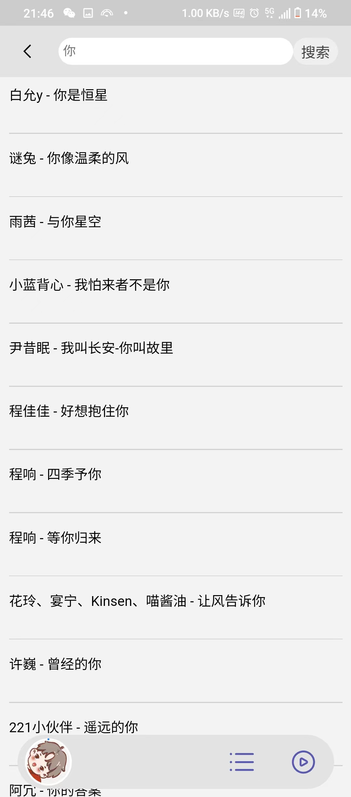
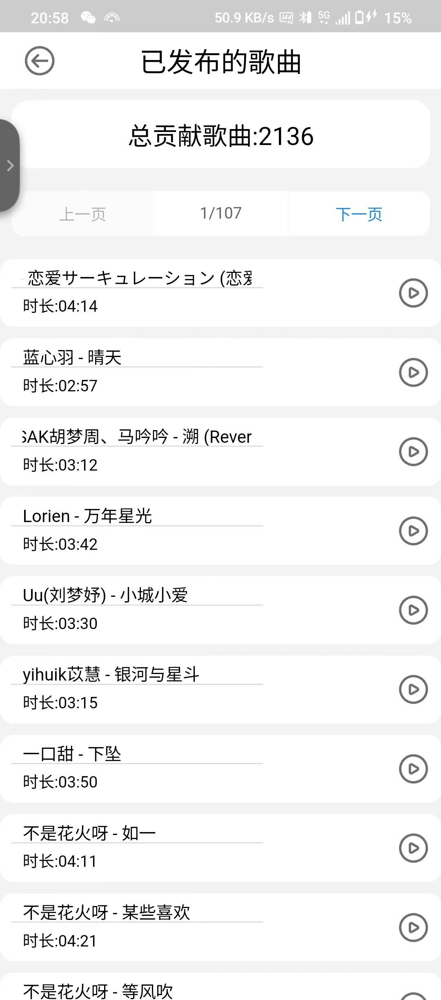
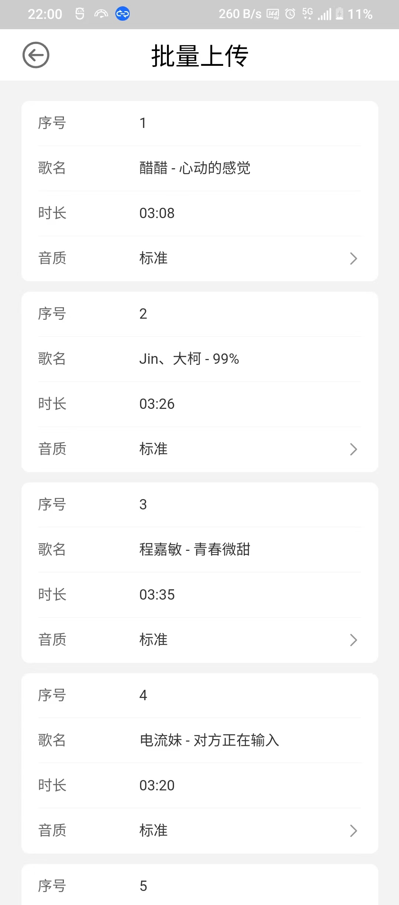

# 哆来(音乐uni-app)
## 项目创建日期:2022-09-23
## 创建人: 多啦C梦(全栈开发)

***

## 技术栈
* vue全家桶
* typescript
* mysql
* 阿里云oss

***

## 项目周期:
### 2022-09-23
**搭建页面及其初始化项目**
### 2022-09-25
**完成音乐的播放效果**
### 2022-09-28
**完成播放列表**
### 2022-09-29
**完成登录注册功能**
### 2022-10-02
**优化部分加载页面**
### 2022-10-03
**新增歌曲上传功能**
### 2022-10-05
**修复页面少量bug及其代码优化**
### 2022-10-06
**实现自动登录**

**优化上传时进度条及分片上传**
### 2022-10-08
**新增批量上传功能**

**新增查看个人上传歌曲总数**
### 2022-10-14
**修复在听歌时,新增歌曲不播放的bug**

**优化上传时遇到重复歌曲的处理**
### 2022-10-18
**优化部分代码**
### 2022-10-23
**新增在搜索时的歌曲模糊查找**
### 2022-10-26
**新增在搜索时的歌曲模糊查找**

***

## 项目预览
### 首界面

### 播放列表

### 搜索界面

### 登录界面

### 个人发布界面

### 上传界面

### 批量上传界面

## 表及其设计
<table border="1">
<tr>
<td>id</td>
<td>歌名</td>
<td>发布人</td>
<td>类型</td>
</tr>
</table>

<table border="1">
<tr>
<td>id</td>
<td>品质</td>
<td>时长</td>
<td>地址</td>
<td>uid</td>
</tr>
</table>

<table border="1">
<tr>
<td>id</td>
<td>username</td>
<td>password</td>
<td>nickname</td>
<td>sex</td>
</tr>
</table>

